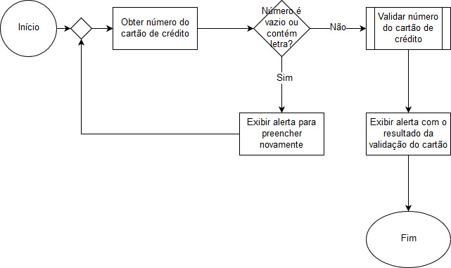

Validação de Cartão de Crédito em Javascript
===============================================

1. Obter número do cartão de crédito via 'prompt';
2. Validar se o número do cartão é vazio ou contém letra;
3. Se a validação for verdadeira, exibir alerta via 'alert' para preencher novamente;
4. Se a validação for falsa, validar número do cartão via 'function isValidCard';
5. Exibir alerta do resultado da validação do número do cartão via 'alert'.

Fluxograma
-----------------------------------------------

